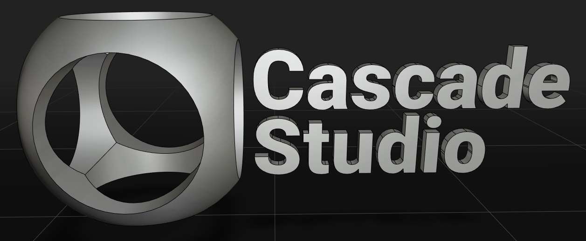
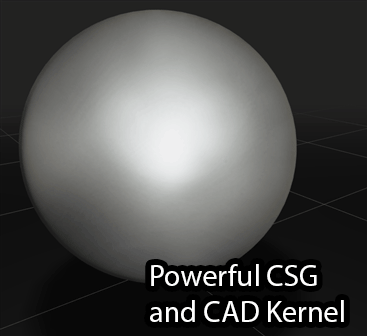
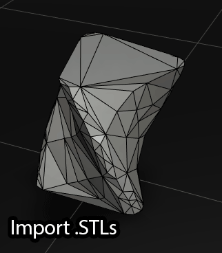
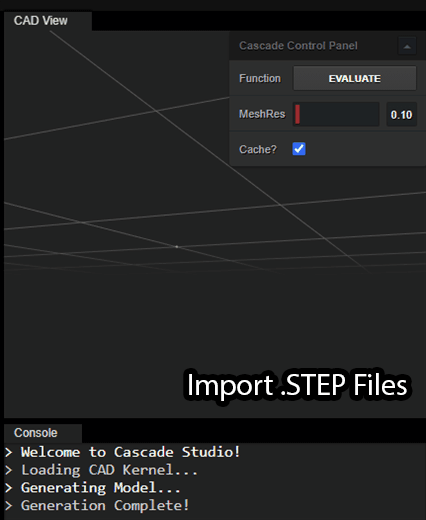
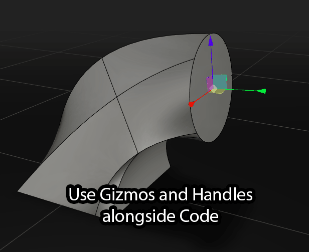
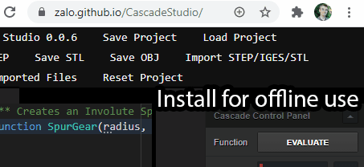
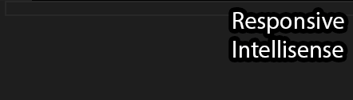
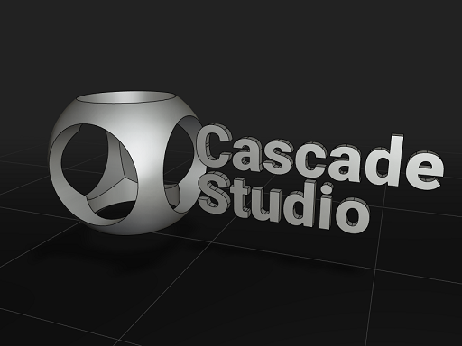
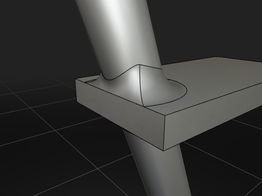

<p align="center">
  <a href="https://zalo.github.io/CascadeStudio/"></a>
</p>
<p align="center">
  <a href="https://github.com/zalo/CascadeStudio/deployments/activity_log?environment=github-pages">
      </a>
  <a href="https://github.com/zalo/CascadeStudio/deployments/activity_log?environment=Production">
      </a>
  <a href="https://github.com/zalo/CascadeStudio/commits/master">
      </a>
  <a href="https://github.com/zalo/CascadeStudio/blob/master/LICENSE">
      </a>
</p>

## A Full Live-Scripted CAD Kernel and IDE in the Browser.

Use code to create 3D Models with features ranging from simple primitives + CSG to complex revolves, sweeps, and fillets. Cascade Studio exposes the full power of the [OpenCascade](https://github.com/Open-Cascade-SAS/OCCT) kernel (OCCT 8.0), while providing a concise standard library for simple operations.

Write in JavaScript or OpenSCAD, visualize in real-time, and export to `.step`, `.stl`, or `.obj`. Copy the URL to share your model with anyone.

## Features

 - **Powerful Standard Library** for primitives, booleans, sweeps, lofts, fillets, and more
 - **Sketch API** with plane parameter (`new Sketch([x,y], 'XZ')`) for drawing in XY, XZ, or YZ planes
 - **Selector API** for querying edges and faces: `Edges(shape).parallel([0,0,1]).max([0,0,1]).indices()`
 - **Measurement Functions**: `Volume()`, `SurfaceArea()`, `CenterOfMass()`
 - **Dual Editor Modes**: JavaScript and OpenSCAD
 - **IntelliSense** autocomplete with full TypeScript definitions and JSDoc
 - **Modeling History Timeline** to scrub through build steps in the 3D viewport
 - **Agent API** (`window.CascadeAPI`) for programmatic control via Playwright or developer tooling
 - Access to the full OpenCASCADE kernel via the `oc.` namespace
 - Automatic caching acceleration of standard library operations
 - `.STEP`/`.IGES`/`.STL` import and `.STEP`/`.STL`/`.OBJ` export
 - URL serialization of code for easy sharing
 - Save/Load projects to preserve code, layout, and imported files
 - Integrated GUI system (sliders, checkboxes, buttons) via Tweakpane
 - Responsive layout with mobile support
 - Installable for offline use as a Progressive Web App
 - **Free and open source under the MIT License**


<p align="center">
  
  
  
  
  <a title="ALPHA: Augment your models with graphical gizmos to get the best of both worlds!" href="https://zalo.github.io/CascadeStudio/?code=fZLBahsxEIbveQqRSz3QitMshTF2ap4gyWFr6MFNVGowcUkc2N5%2BUjuW0HWM6mBs%2F%2Fq%2FH8lRgKN3VJjWjgO8QelsS72KLx8xQqoBYSXHk354iSLHjuF0pJ5Aih3nh8pEFbH5dLZjxlbEW7X5blBTsCRohNCPdEV5F0rhgwmkao0J6h3CM%2Ff%2BQ7nCvM0xDLkDE1W96QZ3dj5mGQJrmdhzezjw5F1D6rIQhPonD6cJput29wuY6AlY0UdIcxVvzNCYlmT5a1aXCYcuCr%2F3wS8EcMO%2FmvvLMLbWx%2FCH%2Fws%3D&gui=q1ZKzs8tyM9LzSvxS8xNVbJSSk4sTk5MSQ3LTC1X0lHyTS3OCEotVrIy0DOE84IS89KBSqMN9AwMdYxidZRCMnNKlKx0jQwgTJg8SMDIACjvlpmTk1pir2RVUlSaqqPknJickQrl1QIA"></a>
  
  
</p>


## Examples

<p align="center">
  <a title="Logo Example" href="https://zalo.github.io/CascadeStudio/?code=lZDBasMwDIbveQqRSz3QitMshTF2ap4gyWFr6MFNVGowcUkc2N5%2BUjuW0HWM6mBs%2F%2Fq%2FH8lRgKN3VJjWjgO8QelsS72KLx8xQqoBYSXHk354iSLHjuF0pJ5Aih3nh8pEFbH5dLZjxlbEW7X5blBTsCRohNCPdEV5F0rhgwmkao0J6h3CM%2Ff%2BQ7nCvM0xDLkDE1W96QZ3dj5mGQJrmdhzezjw5F1D6rIQhPonD6cJput29wuY6AlY0UdIcxVvzNCYlmT5a1aXCYcuCr%2F3wS8EcMO%2FmvvLMLbWx%2FCH%2Fws%3D&gui=q1ZKzs8tyM9LzSvxS8xNVbJSSk4sTk5MSQ3LTC1X0lHyTS3OCEotVrIy0DOE84IS89KBSqMN9AwMdYxidZRCMnNKlKx0jQwgTJg8SMDIACjvlpmTk1pir2RVUlSaqqPknJickQrl1QIA"></a>
  <a title="Default Example" href="https://zalo.github.io/CascadeStudio/?code=lZE%2Fa8MwEMV3f4qLJxVU7ObPUEqGkgydEw9tQgbHOlsCRSqSTJpvX0m2axMKpcIYWXf6ved3WQYbg6VDKGEvBUMDVy4qDlchJVRaOaMlOI5gSiZaC7qOX9VNCuW7bSLRAdcSd1193WNI2h2kFBY5UJiH1zJ%2FeEmSbKr5ydH4jWJQcIMImwHse7S1QjVez%2Bi24SBcFLPdlbDW%2FX2yCuBQHHwdQvG3NfDJ6DmYyyk40%2BId5SNQdtp5r%2BSY0yeanyg8%2B94%2FKHeY9ynGQ%2F6BCWHt27MzZeVi8GM%2BtdGXeNRlkBSmVFb2VsE%2FqyCzFXXtq6pC0gVH4fjji45%2FOm4Pp0H4lTE%2FotoIVEzeoPHzcXEgOupeBGMSZ1Phx%2FkqSi%2BDdIFfbrEl6ZuYpR75DQ%3D%3D&gui=q1ZKzs8tyM9LzSvxS8xNVbJSSk4sTk5MSQ3LTC1X0lHyTS3OCEotVrIy0DOE84IS89KBSqMN9AwMdYxidZSCElMyS4GKjA1gbJgSIwMdE4PYWgA%3D"></a>
  <a title="General Overview Example" href="https://zalo.github.io/CascadeStudio/?code=lVbbbuM2EH33V0z9RCey40uyTZPNQzbZTRdYoIvYRS%2BGH2iJsthIpEBSvrTIv3eGlGzZG3RR52JZnsuZmTOHuriAWSYt4C8HW%2FA8hyf8J8wOElFoZZ3hTqoVZHoDTkNlBVhdCNApuEwAX3OZ82UuIK1U7CR6dDoXFzDNZSLMDTwYwZ3wwWVRopn1X6AvdxBzBUtBMROKzZO%2FKuug5IYXwgljmySFTkTeyYUDB3d1aNb9SnbdCEYRDAeX%2BD748ap3G7K%2FCBdnN3CvQCqMlPIYAWoDieEbqmb8CDbjJQFTCcSVWQvrE3jLO1BiUwdh8%2F5oeOai%2FvWZW%2FQGnyQ2x7HxmesNOnD8%2BiKVmGk2h%2F%2FtAOQA33f4qBLmTCXQCnEyqpZA16Xcwdw7YAM%2B6G2790bEjqtVlXMDpZG2gI10GfUWx%2Fl7BH9Evg9%2FwqMshLJ%2BihQJw7DxMILwh4gi6DQppmUmjDiasL9DQ7OliGUqcayGJ7IKwWaGK5ujLZsPo2FETVpEdRhGn3q9aB%2F9YZdLdcKg5l4Az%2BvYHnkm5Cpz3rmxwpDfgn7QShw3Zq3zNdHPYAv%2F1jIJwROZpsIQU5wufYaldk4XPqcMeTAUG135sSH5rlrgG%2FqxqRAw02XPf0HUOth83OIgEwRTXxAaTz6ea0zLYY0zI8ZKGh5OxDvWxszHgjmWx0Z9qtDXumhheNYOa0zeSrPBkBjeOBnjqu%2Badh6GFrrpy3YbaUNfjwOyJ%2BF%2BwzgeSS80OoLLK2r3HsNXWWLm6UaI8pvyyNnbkVFdz4dpibNDfniCDBdRTRS8GE0i3MNoMlwgZ1KeW9Fmy3MY401zYeFjshI28llsIDdtDKJY6sp5UTmUe7%2BVtlUim49CdvgJu1pHZC32%2BvWmqZPNUR%2BwEf136IS4vSwt2iB%2FSVMr3A3uWO7Zh8NFDiHxYue3h5YYlrsTcAn2n6tYNFEatUY5lbTOqJteIqV60Rv7IsFWxWGitFveMyRnM7F1k0fW%2FRl1c%2FKOhJMY3H3WSG%2FdpTkOxsczDB6HnZk8%2BluQGtwGjktdidmuJHVVgSf7FPKHVhJiRxfLtTrnttteSa93BnXa1%2FFkZPKWWvSvqNmkR6MIf9p9%2FaJT7Opn0vlSh9bWJFPAjeE7UiRPBDoM8JiBGLFKVWkUD8SDO%2B977%2BNRMDY%2FIfcJljFBeZAmzgW7jsALcq%2B9e0HCkY26Uklfp%2BkRFEHUBK32M2eoVpJEyPe00HTGZnrt9SdIRwjoOQ3sROAQ3yV1F6GN2yAeMl6kJKD3ZYlLznE5%2B4lYGZSkmFZA%2FyeoIHEhhM%2F7vbRk36R%2B9OopkLXIm%2BkTTKulpzkFx%2BOKDohwYtUkctysmmNsr6GI8z63%2BgZ%2BVah%2BrOeX2E%2FZBkFkvbePFRzOAQDbny8IeL6vwfNxMqyHh2vaWYQnBzqSoSrDs80Sh9BAramzQn7iE4pDGMo%2FUQhud7SkZc53h8P4M2K9g%2BFtB00Y3d3hx%2F718BYv3kN4P7%2BDy2Hvn3A21Gbbxmxbm22PzOglU7ZP8b5GN8iFWrmsZXXSmW0EO9KjqHaYNyEW%2BAzR2L%2Fur5pvz8%2FDt6%2Bd186%2F&gui=dYwxC8IwEEb%2Fy80hJDVFyOLgrEgQF3E40sMEaSpJioP4342BWkHd7vG9d3ewQ38dAoW8xZ5Ag8VksaODpxsw2FByhhJoweWbDIZzUY%2BCC8maE4M1Wkcr0DmOxMBg58eSLBSX7YRT0wimREn2zttLoFQ8%2BUHza8UkX7bFzNXIP5YdRuzrWq9%2FBmWKs%2FWiL%2FPxBA%3D%3D"></a>
  <a title="Rotated Extrusion Example" href="https://zalo.github.io/CascadeStudio/?code=VY2xCsMwDER3f4VGGxRw0roNhIzpXEo3kyFgYQwmhkSlzd9XeIsGoTvpnjIx8DftfLy3tKwxE4zwKrwwgenH2yeQViD1LPmIZdXeN51DaFppdkbwZ2URLnUWIWkyCDXuZNH11gxKPVLOxFOItOvzazkRRItwR7gKCG%2FYC6vabjbDHw%3D%3D&gui=q1ZKzs8tyM9LzSvxS8xNVbJSSk4sTk5MSQ3LTC1X0lHyTS3OCEotVrIy0DOE84IS89KBSqMN9AwMdYxidZRCMnNKlKx0DS0gTJi8rpGBjpEBUN4tMycntcReyaqkqDS1FgA%3D"></a>
  <a title="Fillet Example" href="https://zalo.github.io/CascadeStudio/?code=RZHNTsMwEITveYpRT65kSNKKQ4UQEhU8AJQDqnrIz7YxJHbluH9CvDu7TgM5JM7ufjOTTZpi6akIhNAQqktrbE0eha1joXSFr%2BPbpzNWSl3SUkAwbUC8HvDWGkEANVlxeaKRQeNmJvdZNr2PQOnOGIGVL2zfsqdaZzyskWfZRuPJnRWfNO5iSSP4A02v%2FJjsg%2FlXFyQwGzKfa2Elj8byOqSEnmXZH%2By6cjR%2Ft8ZZRJgz6X%2FhDQ8nZquWDVVf3FKTF9My%2FTgZk3wnwqUphkZcUHD7uJ7SheA6UL2jHm4be8YG8j1VQRxLCieiuEL0TbGnPqoNUs%2BCKYmpsdBYL3Q%2Blzw%2FScJ2K0ZEmAVrU7G%2BWkTPfD5FVYg0XBkKY4lzXFCbvij5o3bCit12iCtI5w49oXFH8jwAecaRIffwh3E0dNo7H25%2FAQ%3D%3D&gui=q1ZKzs8tyM9LzSvxS8xNVbJSSk4sTk5MSQ3LTC1X0lHyTS3OCEotVrIy0DOE84IS89KBSqMN9AwMdYxidZRCMnNKlKx0jQwgTJg8SMDIACjvlpmTk1pir2RVUlSaqqPknJickQrl1QIA"></a>
  <a title="Loft Example" href="https://zalo.github.io/CascadeStudio/?code=fZE9C8IwEIb3%2ForDKULEVu0gIg6uDiJuwSHGqy2GniQRFPG%2FmzRa%2FMIMubyXu%2FcJF40OCqkwgyn8XUvSlz3VTIjeIOfQbOmGg4B3GQ4PESuj8FfOnLA7SfSDOPDEtZG11dIhEykP1aPgsSLXpDLfGF1H3uP1AT7dy1rim0o%2Fid0X5vCLmac8%2F80c%2BzivjNLIAqH1Svp9WFDhQIIlXe3AlvKI4EpDp33pI4IyZC1YVK6i2iZVAWxeojps6cw6oXfWeRpeGy8mmj%2FgcTAxDNuRwe0O&gui=q1ZKzs8tyM9LzSvxS8xNVbJSSk4sTk5MSQ3LTC1X0lHyTS3OCEotVrIy0DOE84IS89KBSqMN9AwMdYxidZRCMnNKlKx0DS0gTJi8rpGBjpEBUN4tMycntcReyaqkqDRVR8knPw3GqQUA"></a>
</p>


## Getting Started

### Quick Start

```bash
npm install
npm run build
npx http-server ./build -p 8080 -c-1
# Open http://localhost:8080
```

### Standard Library

Cascade Studio provides a concise standard library for common CAD operations:

```javascript
// Primitives
Box(x, y, z, centered?)
Sphere(radius)
Cylinder(radius, height, centered?)
Cone(r1, r2, height)
Circle(radius, wire?)          // wire=true for Loft/Pipe, false for Extrude
Polygon(points, wire?)
Text3D(text, size, height, font?)

// Sketch API — draw in any plane
let face = new Sketch([0, 0])           // default XY plane
  .LineTo([20, 0]).Fillet(3)
  .LineTo([20, 10]).Fillet(3)
  .LineTo([0, 10])
  .End(true).Face();

let profile = new Sketch([0, 0], "XZ")  // XZ plane for Revolve profiles
  .LineTo([15, 0]).LineTo([10, 8]).LineTo([0, 8])
  .End(true).Face();
Revolve(profile, 360);

// Transforms — all return NEW shapes
Translate([x, y, z], shape)
Rotate([ax, ay, az], degrees, shape)
Scale(factor, shape)
Mirror([vx, vy, vz], shape)

// Booleans
Union(shapes)
Difference(mainBody, [tools])
Intersection(shapes)

// Operations
Extrude(face, [dx, dy, dz], keepFace?)
Revolve(shape, degrees, [ax, ay, az]?)
Loft([wires])
Pipe(shape, wirePath)
Offset(shape, distance)
FilletEdges(shape, radius, edgeIndices)
ChamferEdges(shape, distance, edgeIndices)

// Selectors
Edges(shape).ofType("Line"|"Circle").parallel([axis]).max([axis]).min([axis]).indices()
Faces(shape).ofType("Plane"|"Cylinder").max([axis]).indices()

// Measurement
Volume(shape)
SurfaceArea(shape)
CenterOfMass(shape)
```

### OpenSCAD Mode

Switch to OpenSCAD mode via the dropdown in the top navigation bar. Cascade Studio transpiles OpenSCAD to its JavaScript standard library:

```openscad
difference() {
    cube([20, 20, 20], center=true);
    sphere(r=12);
}
```


## Agent API

Cascade Studio exposes `window.CascadeAPI` for programmatic control via [Playwright](https://playwright.dev/) or other browser automation tools.

```javascript
// Navigate and wait for WASM to load
await page.goto('http://localhost:8080');
await page.waitForFunction(() => window.CascadeAPI?.isReady());

// Learn the API
const guide = await page.evaluate(() => CascadeAPI.getQuickStart());

// Run CAD code and check results
const result = await page.evaluate(code => CascadeAPI.runCode(code), `
  let profile = new Sketch([0, 0], "XZ")
    .LineTo([15, 0]).LineTo([10, 8]).LineTo([0, 8])
    .End(true).Face();
  Revolve(profile, 360);
`);
// result = { success: true, errors: [], logs: [...], historySteps: [...] }

// Set camera angle and take a screenshot
await page.evaluate(() => {
  CascadeAPI.setCameraAngle(30, 20);    // azimuth, elevation
  CascadeAPI.saveScreenshot('model.png');
});
```


## Architecture

```
js/MainPage/
  main.js                  ← ESM entry point
  CascadeMain.js           ← App shell, Dockview layout
  CascadeAPI.js            ← window.CascadeAPI for agent/programmatic use
  CascadeView.js           ← 3D viewport (Three.js), modeling timeline
  EditorManager.js         ← Monaco editor, code evaluation
  ConsoleManager.js        ← Console panel, log/error capture
  GUIManager.js            ← Tweakpane GUI panel (sliders, checkboxes)
  FileManager.js           ← File system access (save/load projects)

js/CADWorker/
  CascadeStudioMainWorker.js      ← Web Worker; evaluates user code
  CascadeStudioStandardLibrary.js ← Standard library (Box, Sphere, Sketch, etc.)
  CascadeStudioSelectors.js       ← Edges()/Faces() selector API

js/StandardLibraryIntellisense.ts ← TypeScript definitions for Monaco
```

The build system uses **esbuild** to bundle ESM entry points into `build/`, with static assets (CSS, fonts, textures, Monaco, WASM) copied alongside.


## Testing

Cascade Studio includes a Playwright test suite covering primitives, transforms, booleans, operations, selectors, OpenSCAD, exports, and regression scenarios.

```bash
npm run build
npx playwright test    # 11 tests, ~45s
```

WebGL rendering in headless mode requires `--use-gl=angle --use-angle=swiftshader` (configured in `playwright.config.js`).


## [Community](https://github.com/zalo/CascadeStudio/discussions)

Model code is saved to the URL upon every successful evaluation, so you can copy and paste that link to others to view your model. Share your creations in [Github Discussions](https://github.com/zalo/CascadeStudio/discussions).


## Contributing

```bash
npm install
npm run build
npx http-server ./build -p 8080 -c-1
```

Edit source files in `js/` and `css/`, rebuild, and refresh. Use a new port if changing JS code, as browsers cache ESM aggressively.

Pull Requests to this repo are automatically hosted to Vercel instances, so other users will be able to test and benefit from your modifications as soon as the PR is submitted.


## Credits

Cascade Studio uses:

 - [opencascade.js](https://github.com/donalffons/opencascade.js) (CAD Kernel — OCCT 8.0.0 RC4 via Embind)
 - [Three.js](https://github.com/mrdoob/three.js/) r170 (3D Rendering)
 - [Monaco Editor](https://github.com/microsoft/monaco-editor) (Code Editor with IntelliSense)
 - [Dockview](https://github.com/mathuo/dockview) (Panel Layout System)
 - [Tweakpane](https://github.com/cocopon/tweakpane) v4 (GUI Controls)
 - [opentype.js](https://github.com/opentypejs/opentype.js) (Font Parsing for Text3D)
 - [fflate](https://github.com/101arrowz/fflate) (URL Code Compression)
 - [potpack](https://github.com/mapbox/potpack) (Texture Atlas Packing)
 - [esbuild](https://github.com/evanw/esbuild) (Bundler)
 - [Playwright](https://playwright.dev/) (Testing)

Cascade Studio is maintained by [Johnathon Selstad @zalo](https://github.com/zalo)
