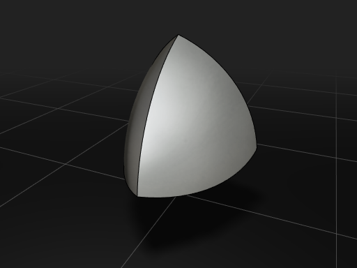

  

  
  
  
  
  

## A Full Live-Scripted CAD Kernel and IDE in the Browser.

Use code to create 3D Models with features ranging from simple primitives + CSG to complex revolves, sweeps, and fillets.  Cascade Studio exposes the full power of the [OpenCascade](http://opencascade.com/) kernel, while providing a concise standard library for simple operations.

Save your completed models to .step, .stl. or .obj, or copy the url and share it with the community.

## Features
 - A Powerful Standard Library to Simplify Model Construction
 - Intellisense Autocomplete/AutoSuggest and Documentation
 - Access to the Full OpenCASCADE Kernel (via the `oc.` namespace)
 - Automatic Caching Acceleration of Standard Library Operations
 - `.STEP`/`.IGES`/`.STL` Import - `.STEP`/`.STL`/`.OBJ` Export
 - URL Serialization of code for easy sharing and ownership
 - Save/Load Projects to preserve Code, Layout, and Imported Files
 - Integrated GUI System for Simple Customization
 - Easily Installable for Offline-use as a Progressive Web App
 - Free and Open Source under the MIT License

## Examples

  <a title="Logo Example" href="https://zalo.github.io/CascadeStudio/?code=lZDBasMwDIbveQqRSz3QitMshTF2ap4gyWFr6MFNVGowcUkc2N5%2BUjuW0HWM6mBs%2F%2Fq%2FH8lRgKN3VJjWjgO8QulsS72KLx8xQqoBYSXHk354iSLHjuF0pJ5Aih3nh8pEFbH5dLZjxlbEW7X5blBTsCRohNCPdEV5F0rhgwmkao0J6h3CM%2Ff%2BQ7nCvM0xDLkDE1W96QZ3dj5mGQJrmdhzezjw5F1D6rIQhPonD6cJput29wuY6AlY0UdIcxVvzNCYlmT5a1aXCYcuCr%2F3wS8EcMO%2FmvvLMLbWx%2FCH%2Fws%3D&gui=q1ZKzs8tyM9LzSvxS8xNVbJSSk4sTk5MSQ3LTC1X0lHyTS3OCEotVrIy0DOE84IS89KBSqMN9AwMdYxidZSCElMyS4GKjA1gbJgSIwMdEwOgCufE5IxUeyWrkqLS1FoA"></a>
  <a title="Default Example" href="https://zalo.github.io/CascadeStudio/?code=lZE%2Fa8MwEMV3f4qLJxVU7ObPUEqGkgydEw9tQgbHOlsCRSqSTJpvX0m2axMKpcIYWXf6ved3WQYbg6VDKGEvBUMDVy4qDlchJVRaOaMlOI5gSiZaC7qOX9VNCuW7bSLRAdcSd1193WNI2h2kFBY5UJiH1zJ%2FeEmSbKr5ydH4jWJQcIMImwHse7S1QjVez%2Bi24SBcFLPdlbDW%2FX2yCuBQHHwdQvG3NfDJ6DmYyyk40%2BId5SNQdtp5r%2BSY0yeanyg8%2B94%2FKHeY9ynGQ%2F6BCWHt27MzZeVi8GM%2BtdGXeNRlkBSmVFb2VsE%2FqyCzFXXtq6pC0gVH4fjji45%2FOm4Pp0H4lTE%2FotoIVEzeoPHzcXEgOupeBGMSZ1Phx%2FkqSi%2BDdIFfbrEl6ZuYpR75DQ%3D%3D&gui=q1ZKzs8tyM9LzSvxS8xNVbJSSk4sTk5MSQ3LTC1X0lHyTS3OCEotVrIy0DOE84IS89KBSqMN9AwMdYxidZSCElMyS4GKjA1gbJgSIwMdE4PYWgA%3D"></a>
  <a title="General Overview Example" href="https://zalo.github.io/CascadeStudio/?code=lVbbbuM2EH33V0z9RCey40uyTZPNQzbZTRdYoIvYRS%2BGH2iJsthIpEBSvrTIv3eGlGzZG3RR52JZnsuZmTOHuriAWSYt4C8HW%2FA8hyf8J8wOElFoZZ3hTqoVZHoDTkNlBVhdCNApuEwAX3OZ82UuIK1U7CR6dDoXFzDNZSLMDTwYwZ3wwWVRopn1X6AvdxBzBUtBMROKzZO%2FKuug5IYXwgljmySFTkTeyYUDB3d1aNb9SnbdCEYRDAeX%2BD748ap3G7K%2FCBdnN3CvQCqMlPIYAWoDieEbqmb8CDbjJQFTCcSVWQvrE3jLO1BiUwdh8%2F5oeOai%2FvWZW%2FQGnyQ2x7HxmesNOnD8%2BiKVmGk2h%2F%2FtAOQA33f4qBLmTCXQCnEyqpZA16Xcwdw7YAM%2B6G2790bEjqtVlXMDpZG2gI10GfUWx%2Fl7BH9Evg9%2FwqMshLJ%2BihQJw7DxMILwh4gi6DQppmUmjDiasL9DQ7OliGUqcayGJ7IKwWaGK5ujLZsPo2FETVpEdRhGn3q9aB%2F9YZdLdcKg5l4Az%2BvYHnkm5Cpz3rmxwpDfgn7QShw3Zq3zNdHPYAv%2F1jIJwROZpsIQU5wufYaldk4XPqcMeTAUG135sSH5rlrgG%2FqxqRAw02XPf0HUOth83OIgEwRTXxAaTz6ea0zLYY0zI8ZKGh5OxDvWxszHgjmWx0Z9qtDXumhheNYOa0zeSrPBkBjeOBnjqu%2Badh6GFrrpy3YbaUNfjwOyJ%2BF%2BwzgeSS80OoLLK2r3HsNXWWLm6UaI8pvyyNnbkVFdz4dpibNDfniCDBdRTRS8GE0i3MNoMlwgZ1KeW9Fmy3MY401zYeFjshI28llsIDdtDKJY6sp5UTmUe7%2BVtlUim49CdvgJu1pHZC32%2BvWmqZPNUR%2BwEf136IS4vSwt2iB%2FSVMr3A3uWO7Zh8NFDiHxYue3h5YYlrsTcAn2n6tYNFEatUY5lbTOqJteIqV60Rv7IsFWxWGitFveMyRnM7F1k0fW%2FRl1c%2FKOhJMY3H3WSG%2FdpTkOxsczDB6HnZk8%2BluQGtwGjktdidmuJHVVgSf7FPKHVhJiRxfLtTrnttteSa93BnXa1%2FFkZPKWWvSvqNmkR6MIf9p9%2FaJT7Opn0vlSh9bWJFPAjeE7UiRPBDoM8JiBGLFKVWkUD8SDO%2B977%2BNRMDY%2FIfcJljFBeZAmzgW7jsALcq%2B9e0HCkY26Uklfp%2BkRFEHUBK32M2eoVpJEyPe00HTGZnrt9SdIRwjoOQ3sROAQ3yV1F6GN2yAeMl6kJKD3ZYlLznE5%2B4lYGZSkmFZA%2FyeoIHEhhM%2F7vbRk36R%2B9OopkLXIm%2BkTTKulpzkFx%2BOKDohwYtUkctysmmNsr6GI8z63%2BgZ%2BVah%2BrOeX2E%2FZBkFkvbePFRzOAQDbny8IeL6vwfNxMqyHh2vaWYQnBzqSoSrDs80Sh9BAramzQn7iE4pDGMo%2FUQhud7SkZc53h8P4M2K9g%2BFtB00Y3d3hx%2F718BYv3kN4P7%2BDy2Hvn3A21Gbbxmxbm22PzOglU7ZP8b5GN8iFWrmsZXXSmW0EO9KjqHaYNyEW%2BAzR2L%2Fur5pvz8%2FDt6%2Bd186%2F&gui=dYwxC8IwEEb%2Fy80hJDVFyOLgrEgQF3E40sMEaSpJioP4342BWkHd7vG9d3ewQ38dAoW8xZ5Ag8VksaODpxsw2FByhhJoweWbDIZzUY%2BCC8maE4M1Wkcr0DmOxMBg58eSLBSX7YRT0wimREn2zttLoFQ8%2BUHza8UkX7bFzNXIP5YdRuzrWq9%2FBmWKs%2FWiL%2FPxBA%3D%3D"></a>
  
  <a title="Fillet Example" href="https://zalo.github.io/CascadeStudio/?code=RZHNTsMwEITveYpRT65kSNKKQ4UQEhU8AJQDqnrIz7YxJHbluH9CvDu7TgM5JM7ufjOTTZpi6akIhNAQqktrbE0eha1joXSFr%2BPbpzNWSl3SUkAwbUC8HvDWGkEANVlxeaKRQeNmJvdZNr2PQOnOGIGVL2zfsqdaZzyskWfZRuPJnRWfNO5iSSP4A02v%2FJjsg%2FlXFyQwGzKfa2Elj8byOqSEnmXZH%2By6cjR%2Ft8ZZRJgz6X%2FhDQ8nZquWDVVf3FKTF9My%2FTgZk3wnwqUphkZcUHD7uJ7SheA6UL2jHm4be8YG8j1VQRxLCieiuEL0TbGnPqoNUs%2BCKYmpsdBYL3Q%2Blzw%2FScJ2K0ZEmAVrU7G%2BWkTPfD5FVYg0XBkKY4lzXFCbvij5o3bCit12iCtI5w49oXFH8jwAecaRIffwh3E0dNo7H25%2FAQ%3D%3D&gui=q1ZKzs8tyM9LzSvxS8xNVbJSSk4sTk5MSQ3LTC1X0lHyTS3OCEotVrIy0DOE84IS89KBSqMN9AwMdYxidZRCMnNKlKx0jQwgTJg8SMDIACjvlpmTk1pir2RVUlSaqqPknJickQrl1QIA"></a>
  <a title="Reuleaux Tetrahedron Example" href="https://zalo.github.io/CascadeStudio/?code=nZE9T8NADIb3%2FIp3vEgXLh%2BtQEJMTAwstFvV4ZS6TaToAj4n8PMxSUUYKFI5yYMt63mfk53DI5MXwrEfGPG1IaYIL5CGMBJLW2vfH%2BHBdBo6zxAS9g0duA9JR4KxwAM2te%2FI3K4ttuxD7BRpdigskFtkpnDPXpqb%2BMZiyjTdW2ymKLOM71yV6rufmeUlZvZ%2FZnXRU3mT6%2FXM1V%2FM7Gpm4hyeghBHqucbzLtxSmMaOvLDx3a5gMZ%2F77d9MLtRM8dSq9Ja7c%2FMSRE%2BHBZFvThjbOm9Dafkh3huc7vO1fKll%2FOgsF99UeoPf1FQ708%3D&gui=q1ZKzs8tyM9LzSvxS8xNVbJSSk4sTk5MSQ3LTC1X0lHyTS3OCEotVrIy0DOE84IS89KBSqMN9AwMdYxidZSCElMyS4GKjA1gbJgSIwMdEwOgCrfMnJzUEnslq7TEnOLUWgA%3D"></a>
  <a title="Loft Example" href="https://zalo.github.io/CascadeStudio/?code=fZE9C8IwEIb3%2ForDKULEVu0gIg6uDiJuwSHGqy2GniQRFPG%2FmzRa%2FMIMubyXu%2FcJF40OCqkwgyn8XUvSlz3VTIjeIOfQbOmGg4B3GQ4PESuj8FfOnLA7SfSDOPDEtZG11dIhEykP1aPgsSLXpDLfGF1H3uP1AT7dy1rim0o%2Fid0X5vCLmac8%2F80c%2BzivjNLIAqH1Svp9WFDhQIIlXe3AlvKI4EpDp33pI4IyZC1YVK6i2iZVAWxeojps6cw6oXfWeRpeGy8mmj%2FgcTAxDNuRwe0O&gui=q1ZKzs8tyM9LzSvxS8xNVbJSSk4sTk5MSQ3LTC1X0lHyTS3OCEotVrIy0DOE84IS89KBSqMN9AwMdYxidZRCMnNKlKx0DS0gTJi8rpGBjpEBUN4tMycntcReyaqkqDRVR8knPw3GqQUA"></a>

## [Community](https://github.com/zalo/CascadeStudio/issues)

Model code is saved to the URL upon every successful evaluation, so you can copy and paste that link to others to view your model.  Until [Github Discussions](https://github.blog/2020-05-06-new-from-satellite-2020-github-codespaces-github-discussions-securing-code-in-private-repositories-and-more/#discussions) comes out of beta, feel free to use the ["Issues" tab](https://github.com/zalo/CascadeStudio/issues) to share your creations and examples, as well as to report bugs and comments.

## Contributing

Cascade Studio is entirely static assets and vanilla javascript, so running it locally is as simple as running a server from the root directory (such as the [VS Code Live Server](https://github.com/ritwickdey/vscode-live-server), [Python live-server](https://pypi.org/project/live-server/), or [Node live-server](https://www.npmjs.com/package/live-server) ).

Pull Requests to this repo are automatically hosted to Vercel instances, so other users will be able to test and benefit from your modifications as soon as the PR is submitted.

## Credits

Cascade Studio uses:

 - [opencascade.js](https://github.com/donalffons/opencascade.js) (CAD Kernel)
 - [Golden Layout](https://github.com/golden-layout/golden-layout) (Windowing System)
 - [three.js](https://github.com/mrdoob/three.js/) (3D Rendering Engine)
 - [controlkit.js](https://github.com/automat/controlkit.js) (Buttons/Sliders),
 - [Monaco Editor](https://github.com/microsoft/monaco-editor) (Text Editing and Intellisense)
 - [opentype.js](https://github.com/opentypejs/opentype.js) (Font Parsing)
 - [rawinflate/rawdeflate](https://github.com/dankogai/js-deflate) (URL Code Serialization)

Cascade Studio is maintained by Johnathon Selstad ( @zalo )
